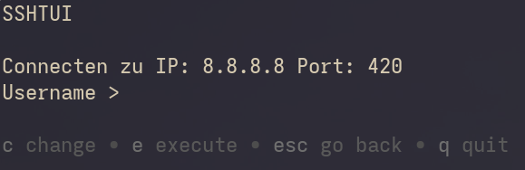

# sshtui

Tui for connecting to your different servers written in Go with [bubbletea](https://github.com/charmbracelet/bubbletea) and [bubbles](https://github.com/charmbracelet/bubbles) components. The ips are based on your known hosts file so you cant add new ones in the tui. 

## Home Screen

## Connection Screen

